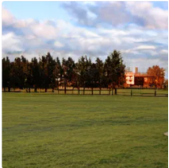

# StyleDrop

<p align="left">
  <a href="https://huggingface.co/spaces/zideliu/styledrop"></a>
</p>


This is an unofficial PyTorch implementation of [StyleDrop: Text-to-Image Generation in Any Style](https://arxiv.org/abs/2306.00983).


Unlike the parameters in the paper in (Round 1), we set $\lambda_A=2.0$, $\lambda_B=5.0$ and `d_prj=32`, `is_shared=False`, which we found work better, these hyperparameters can be seen in `configs/custom.py`.

we release them to facilitate community research.



<br/><br/>

<br/><br/>


## Data & Weights Preparation
VQGAN 다운로드 [link](https://drive.google.com/file/d/13S_unB87n6KKuuMdyMnyExW0G1kplTbP/view) (from [MAGE](https://github.com/LTH14/mage), thanks!)
다운로드 이후 assets 폴더에 vqgan 체크포인트 파일을 넣고 `assets/vqgan_jax_strongaug.ckpt`.로 파일명 변경

pre-trained 체크포인트 다운로드 [link](https://huggingface.co/nzl-thu/MUSE/tree/main/assets/ckpts) 
이후, custom dataset으로 추가 학습 진행

`python extract_empty_feature.py`
명령어 실행으로 필요한 empty_feature파일 생성

최종 디렉토리 구조:
```
.
├── assets
│   ├── ckpts
│   │   ├── cc3m-285000.ckpt
│   │   │   ├── lr_scheduler.pth
│   │   │   ├── nnet_ema.pth
│   │   │   ├── nnet.pth
│   │   │   ├── optimizer.pth
│   │   │   └── step.pth
│   │   └── imagenet256-450000.ckpt
│   │       ├── lr_scheduler.pth
│   │       ├── nnet_ema.pth
│   │       ├── nnet.pth
│   │       ├── optimizer.pth
│   │       └── step.pth
│   ├── fid_stats
│   │   ├── fid_stats_cc3m_val.npz
│   │   └── fid_stats_imagenet256_guided_diffusion.npz
│   ├── pipeline.png
|   ├── contexts
│   │   └── empty_context.npy
└── └── vqgan_jax_strongaug.ckpt

```


## Dependencies
```
conda install pytorch torchvision torchaudio cudatoolkit=11.3
pip install accelerate==0.12.0 absl-py ml_collections einops wandb ftfy==6.1.1 transformers==4.23.1 loguru webdataset==0.2.5 gradio
```

## Train
data 디렉토리에 이미지 파일 위치
이미지 파일은 coco데이터셋 활용
카테고리 80개 
이미지 약 65000장 -> 4000장 활용

1. data/one_style.json 파일 수정. 형식은 file_name:[object,style]
   style = None으로 진행

```json
{"train_4000/COCO_train2014_000000353651.jpg": [
        "a toilet bowl on the floor in a tiled bathroom",
        "A standing bathroom stall with a metal hose.",
        "A close up look at a small white floor drain in a rest room.",
        "a rom showing a toilet and a shower",
        "A grey tiled shower features a ground toilet."]}
```
2. Training script
```shell
#!/bin/bash
unset EVAL_CKPT
unset ADAPTER
export OUTPUT_DIR="output_dir/for/this/experiment"
accelerate launch --num_processes 8 --mixed_precision fp16 train_t2i_custom_v2.py --config=configs/custom.py
```
configs/custom.py
config.data_path = 'data/one_style.json"
n_steps=10000,batch_size=8
gradio_demo.py 에서 muse모델의 gen_temp 기존 4.5 -> 3.0으로 변경

## Inference

pretrained style_adapter 가중치 다운로드 [🤗 Hugging Face](https://huggingface.co/zideliu/StyleDrop/tree/main).
```shell
#!/bin/bash
export EVAL_CKPT="assets/ckpts/cc3m-285000.ckpt" 
export ADAPTER="path/to/your/style_adapter"

export OUTPUT_DIR="output/for/this/experiment"

accelerate launch --num_processes 8 --mixed_precision fp16 train_t2i_custom_v2.py --config=configs/custom.py
```


## Gradio Demo
Put the [style_adapter weights](https://huggingface.co/zideliu/StyleDrop/tree/main) in `./style_adapter` folder and run the following command will launch the demo:

```shell
python gradio_demo.py
```

The demo is also hosted on [HuggingFace](https://huggingface.co/spaces/zideliu/styledrop).

## Citation
```bibtex
@article{sohn2023styledrop,
  title={StyleDrop: Text-to-Image Generation in Any Style},
  author={Sohn, Kihyuk and Ruiz, Nataniel and Lee, Kimin and Chin, Daniel Castro and Blok, Irina and Chang, Huiwen and Barber, Jarred and Jiang, Lu and Entis, Glenn and Li, Yuanzhen and others},
  journal={arXiv preprint arXiv:2306.00983},
  year={2023}
}
```


## Acknowlegment

* The implementation is based on [MUSE-PyTorch](https://github.com/baaivision/MUSE-Pytorch)
* Many thanks for the generous help from [Zanlin Ni](https://github.com/nzl-thu)
